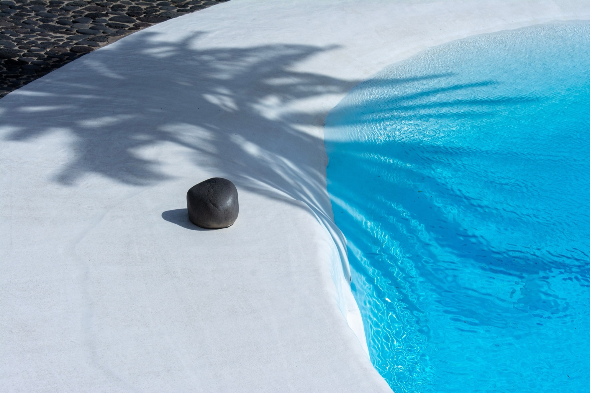

<div align="center">



# Fondation César Manrique — l'API

**Collection, archives, visite et billets, en JSON**

API de contenu du site, réalisée dans le cadre d'un projet d'étude sur Next.js 16.

[](https://nextjs.org)
[](https://nextjs.org/docs/app/getting-started/route-handlers)
[](https://biomejs.dev)
[](https://museum-api-topaz.vercel.app)

[**Voir la documentation en ligne**](https://museum-api-topaz.vercel.app) · [Le site](../frontend/README.md) · [Critique de Next.js](../README.md#critique-constructive-de-nextjs-16)

</div>

---

## Sommaire

1. [Endpoints](#endpoints)
2. [Lancer le projet](#lancer-le-projet)
3. [Architecture](#architecture)
4. [Choix techniques](#choix-techniques)
5. [Déploiement](#déploiement)

---

## Endpoints

| Méthode | Route | Contenu |
|---|---|---|
| `GET` | `/objects` | la collection : espaces et tableaux (filtres `category`, `type`, `artist`, `q`) |
| `GET` | `/objects/{slug}` | une fiche, avec sa couverture, sa galerie et ses fiches proches |
| `GET` | `/archive` | les 27 photographies de l'archive (filtre `type`) |
| `GET` | `/archive/{slug}` | une photographie |
| `GET` | `/artists`, `/artists/{slug}` | les artistes |
| `GET` | `/visit` | adresse, horaires, tarifs, jours d'ouverture à venir |
| `POST` | `/tickets` | demande de billets et référence de retrait (démonstration) |

Erreurs : `{ "error": "…" }` avec 404 (objet inconnu), 400 (requête invalide, `fields` par champ pour les billets) ou 500.

> [!TIP]
> La page d'accueil de l'API est sa documentation complète. Ses exemples de réponse sont générés à partir des données réelles.

## Lancer le projet

```bash
npm install
npm run dev      # http://localhost:4000
npm run build
npm run start    # serveur de production sur le port 4000
npm run lint     # Biome
npm run similar  # recalcule les fiches proches après un ajout ou un retrait de fiche
```

Aucune variable d'environnement n'est nécessaire.

## Architecture

<details>
<summary><strong>Arborescence</strong></summary>

<br />

```
src/
  app/page.js             documentation (Server Component, exemples issus des données)
  app/*/route.js          Route Handlers, un dossier par ressource
  lib/data.js             mise en forme des données : URL d'images, liens, filtres
  lib/images.js           URL des photographies, servies depuis le dossier public
  lib/http.js             réponses JSON : CORS, Cache-Control, erreurs
  lib/visit.js            jours d'ouverture, validation d'une demande, référence
  data/*.json             objects, archive, artists, visit
public/images/            photographies de la collection et de l'archive (2000 px)
tools/similar-works.mjs   fiches proches (type, artiste, matériaux, année)
```

</details>

## Choix techniques

| | |
|---|---|
| **Données** | JSON versionné, un fichier par ressource, sans base de données. Les fichiers ne contiennent que des chemins `/images/…` ; l'URL complète est construite à partir de l'adresse du déploiement. |
| **Collection** | Chaque fiche porte une catégorie : `space` pour un lieu, `work` pour un tableau. Les tableaux non documentés gardent un titre descriptif, `year` à `null` et une notice qui le dit. |
| **Photographies** | Une photographie n'est attribuée à un lieu qu'après vérification de sa page Pexels ; chaque notice cite son photographe. |
| **Routes** | Un `route.js` par ressource, des filtres en query string, un 404 explicite pour un slug inconnu. Toutes les réponses passent par `src/lib/http.js`. |
| **Cache et CORS** | Lectures en `s-maxage=3600` avec `stale-while-revalidate` (dix minutes pour `/visit`, qui dépend de la date) ; toutes les origines sont autorisées. |
| **Billetterie** | Démonstration sans persistance : validation, total, référence `FCM-AAMMJJ-XXXX`. Rien n'est transmis à la Fondation. |

## Déploiement

Projet Vercel relié au dépôt, avec `backend` comme « Root Directory », sans variable d'environnement. L'adresse affichée dans la documentation et les URL d'images viennent de `VERCEL_PROJECT_PRODUCTION_URL`. Côté site, `FCM_API_URL` reçoit l'adresse de ce déploiement.

---

<div align="center">

Projet d'étude · Informations : fcmanrique.org et cactlanzarote.com · Photographies : Vladimir Kysela et photographes de Pexels, cités dans chaque notice

</div>
